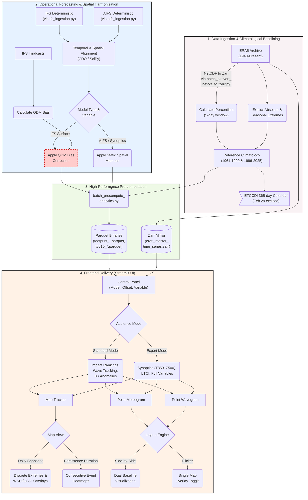

# AtmoPulse: Real-Time Synoptic Extreme Tracking

**AtmoPulse** is an interactive, web-based analytical tool designed to dynamically track, visualize, and contextualize pan-European and local synoptic extremes. By fusing live atmospheric forecasting (IFS/AIFS) with shifting historical climate baselines (ERA5), the platform transitions complex persistence indices into live, forward-looking forecast overlays. A public beta (Version 1.0) is targeted for October 2026, scaling to Version 2.0 during 2027.

## Method & Scientific Rigor

* **Predictive Persistence:** ETCCDI WSDI/CSDI-style persistence is shown as a live overlay on forecasts, allowing users to benchmark current thermal extremes against historical baselines.
* **Physical Consistency:** ECMWF IFS and AIFS forecasts are regridded onto the ERA5 grid via CDO conservative (fracarea-normalised) regridding matrices. IFS surface temperatures (TG, TN, TX) are calibrated using Quantile Delta Mapping (QDM) against a 20-year hindcast to neutralize model biases. AIFS, natively trained on ERA5, bypasses this step to retain 3D physical integrity.
* **Standardized 365-Day Calendar:** To ensure statistical homoscedasticity within the 5-day moving window, leap days (February 29th) are systematically excised from the baseline matrices. In the live frontend, leap day values are plotted on their actual date but benchmarked against March 1st thresholds.
* **Kyselý Wave Analytics:** Heatwaves are tracked using summer maximums (TX), while coldwaves are tracked using winter minimums (TN).
* **Dual-Mode UI:** 
  * *Standard Mode:* Focuses on mean temperature (TG) anomalies, TX/TN wave tracking, MSLP, and automated Top-10 spatial impact rankings (Micro-territories are excluded from impact rankings).
  * *Expert Mode:* Adds mid-tropospheric causality (Z500, T850, U300/V300 jet streams) and Universal Thermal Climate Index (UTCI). **Note:** UTCI analytics are currently restricted to a trailing 5-day historical window based exclusively on ERA5 reanalysis due to operational forecast constraints.

---

## System Architecture

The following diagram outlines the high-performance data pipeline. Spatial matrices and bias-corrected differentials are pre-calculated via Python background tasks (`batch_precompute_analytics.py`) and stored as lightweight Parquet binaries to eliminate frontend NetCDF latency. Point-based time series are extracted via a consolidated Zarr mirror (`era5_master_time_series.zarr`).



---

## Strategic Roadmap (Version 2.x)

* **Probabilistic Ensemble Forecasting:** Integration of 51-member ensemble forecasting (IFS ENS / AIFS ENS) to track signal probabilities up to 10 days out.
* **Hydro-climate Expansion:** Bridging thermal anomalies with regional drought and heavy rainfall risks using indices like Consecutive Dry/Wet Days (CDD/CWD) indices.

---

## Quick Start (Local Development)

```powershell
cd "C:\Users\liina\Andreas ERA5"
conda activate cee_env
streamlit run app.py
```

The app opens at `http://localhost:8501`. NetCDF/Zarr archives are **not** in git; without the reference climatology, the app halts on startup.

### Required Data Hierarchy (Local Only)

Place the following files under `ERA5_ClimateTool/`:

* `Reference_Climatology/` — `climatology_reference_complete.nc`, `climatology_synoptics.nc`, optional `qdm_transfer_functions.nc` and `regrid_weights_cdo.nc`.
* `Master_Batches/` — `era5_master_daily_YYYY.nc`.
* `Live_Forecasts/` — `ifs_daily_forecast_*.nc`, `aifs_daily_forecast_*.nc`.
* `Pipeline_Logs/` — timestamped `pipeline_YYYYMMDD_HHMMSS.log` from `run_atmopulse_pipeline.bat`.
* `Zarr_Archive/` — `era5_master_time_series.zarr`.
* `Precomputed_Analytics/` — `footprint_*.parquet`, `top10_*.parquet`.

### Credentials

* **ERA5 / CDS:** Copernicus CDS API key must be in `%USERPROFILE%\.cdsapirc` (not in GitHub).
* **IFS / AIFS open data:** `ecmwf-opendata` requires no key. Optional MARS/ECMWF API credentials belong in `%USERPROFILE%\.ecmwfapirc` (not in GitHub).

### Project Layout & Core Modules

| File | Role |
|---|---|
| `app.py` | Streamlit frontend and UI orchestration. |
| `atmopulse_theme.py` | ETCCDI-compliant color sequences, CSS, and brand styling. |
| `backend_maps.py` | Geospatial dataset harmonization, physical bounds masking, and live overlay. |
| `backend_map_locations.py` | STRtree spatial indexing for location labels and area-weighted Top-10 masking. |
| `backend_analytics.py` | Parquet precomputation ingestion for spatial footprints and impact analytics. |
| `backend_io.py` | High-speed Zarr extraction and QDM bias correction ingestion. |
| `backend_narrative.py` | Automated, state-sensitive text generation for UI descriptions. |
| `backend_waves.py` | Kyselý definitions for seasonal heat/cold wave extraction and Plotly ridge-plot rendering. |
| `ifs_ingestion.py` | Live ECMWF IFS retrieval and CDO regridding pipeline. |
| `aifs_ingestion.py` | Live ECMWF AIFS retrieval and CDO regridding pipeline. |

*(Note: Data pipeline automation relies on `batch_precompute_analytics.py` for Parquet generation and `batch_convert_netcdf_to_zarr.py` for Zarr mirroring.)*

---

*Architected by Dr. Andreas Hoy | Applied Climatologist & Digital Climate Service Developer*
