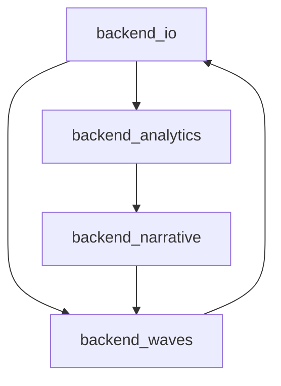
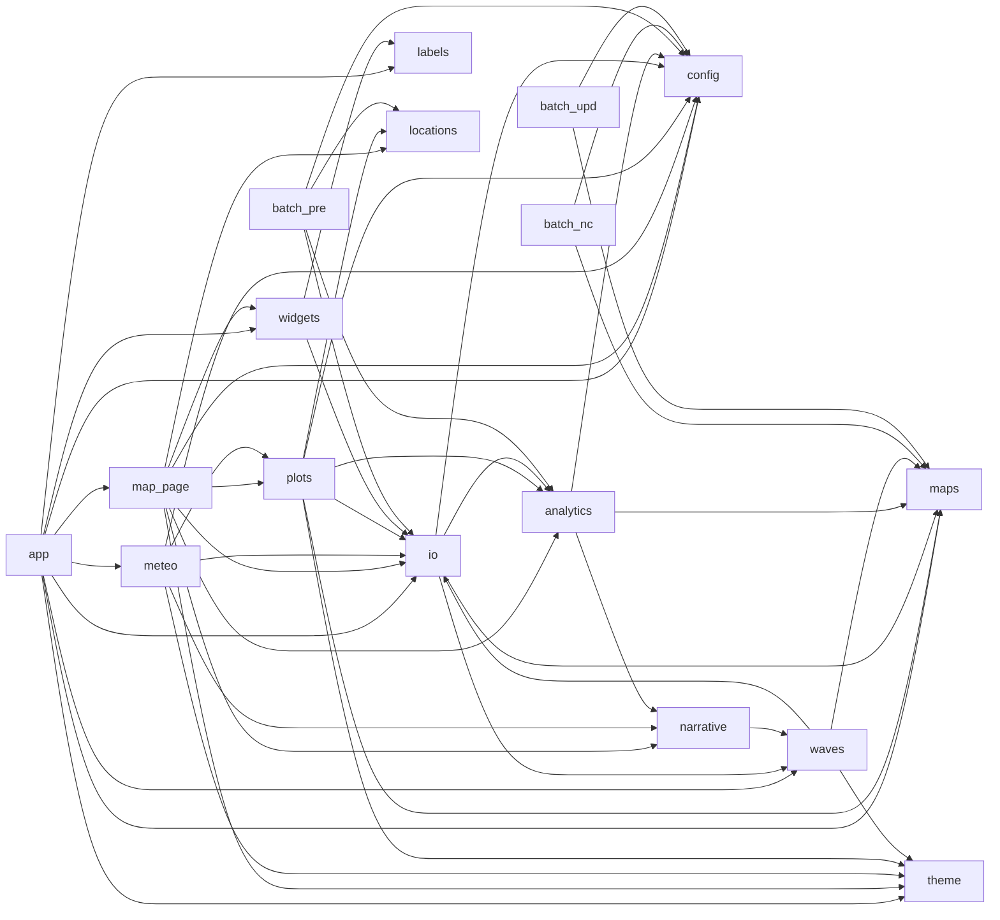

# Backend-Inventur · AtmoPulse / ERA5

Live-Python im Repo-Root. Backup-Ordner und LinkedIn-Plots sind archiviert und nicht Teil der Laufzeit.

**Gemessen:** 4. Sep 2026  
**LoC:** physische Zeilen (inkl. Leerzeilen und Kommentare); Code-LoC ohne Leerzeilen und Kommentare  
**McCabe:** AST (`if` / `for` / `while` / `except` / `assert` / ternary / `and`–`or` / comprehensions / `match` / `with`)

| Kennzahl | Wert |
|---|---|
| Backend-Skripte | 22 |
| Backend LoC (physisch) | 7049 |
| Backend Code-LoC | 4902 |
| Zirkuläre Imports | 1 SCC / 2 Zyklen |

Zyklomatische Komplexität **47** in `get_kiesely_waves_figs` (211 Zeilen). McCabe ≥ 21 gilt als hohes Risiko. Zusätzlich ein Import-Zyklus zwischen `backend_io` ↔ `backend_waves` und der größeren SCC `io → analytics → narrative → waves → io`.

---

## LoC nach Skript

Quelle: Repo-Root · nach physischen Zeilen sortiert · 4. Sep 2026

| Skript | Rolle | LoC | Code |
|---|---|---:|---:|
| `backend_io.py` | Serving / I/O | 848 | 574 |
| `backend_waves.py` | Hitzewellen | 838 | 610 |
| `ifs_ingestion.py` | Ingestion IFS | 650 | 527 |
| `aifs_ingestion.py` | Ingestion AIFS | 631 | 513 |
| `backend_maps.py` | Karten / Raster | 538 | 351 |
| `backend_analytics.py` | Analytics | 418 | 272 |
| `backend_narrative.py` | Narrative | 344 | 157 |
| `backend_map_locations.py` | Geo / Länder | 279 | 186 |
| `batch_precompute_analytics.py` | Batch | 244 | 148 |
| `era5_phase2_2m-temp.py` | ERA5 Pipeline | 222 | 149 |
| `era5_init_2026.py` | ERA5 Pipeline | 220 | 173 |
| `era5_climatology_builder.py` | Klimatologie | 217 | 144 |
| `calculate_qdm_bias.py` | QDM Bias | 208 | 150 |
| `era5_phase3_utci.py` | ERA5 Pipeline | 205 | 154 |
| `era5_daily_updater.py` | ERA5 Pipeline | 201 | 149 |
| `era5_phase1_synoptics.py` | ERA5 Pipeline | 181 | 120 |
| `batch_convert_netcdf_to_zarr.py` | Batch | 179 | 114 |
| `era5_synoptic_climatology.py` | Klimatologie | 161 | 118 |
| `batch_update_zarr.py` | Batch | 151 | 88 |
| `evaluate_master.py` | QA Master | 140 | 100 |
| `config.py` | Konfiguration | 117 | 78 |
| `download_era5_invariants.py` | Ingestion | 57 | 27 |
| **Summe** | | **7049** | **4902** |

### UI-Schicht (nicht Backend, aber Import-Partner)

UI gesamt **3466** physische Zeilen. `backend_waves` importiert `atmopulse_theme` — Theme-Kopplung ins Serving-Backend.

| Skript | Rolle | LoC | Code |
|---|---|---:|---:|
| `frontend_plots.py` | Plots | 987 | 756 |
| `atmopulse_theme.py` | Theme | 941 | 796 |
| `app.py` | Streamlit Einstieg | 626 | 286 |
| `page_map_tracker.py` | Seite | 459 | 392 |
| `page_meteogram.py` | Seite | 245 | 173 |
| `labels.py` | Labels | 105 | 76 |
| `frontend_widgets.py` | Widgets | 103 | 53 |
| **Summe** | | **3466** | **2532** |

---

## McCabe der Kernfunktionen

Schwellen: 1–10 einfach, 11–20 moderat, ≥21 hoch. Download-Pfade sind separat, weil sie I/O-Orchestrierung sind, keine Physik.

| Kennzahl | Funktion | CC |
|---|---|---:|
| Höchste CC | `get_kiesely_waves_figs` | 47 |
| Detektion | `_detect_kysely_waves` | 20 |
| QDM | `build_qdm_matrices` | 9 |

| Funktion | Typ | CC | Fn-LoC |
|---|---|---:|---:|
| `backend_waves.get_kiesely_waves_figs` | Orchestrierung + Plot | 47 | 211 |
| `backend_maps.get_synoptic_map_data` | Karten-Assembly | 24 | 80 |
| `backend_io._load_persistence_daily_series` | Persistenz / I/O | 22 | 58 |
| `backend_waves._era5_master_point_series_from_netcdf` | Punkt-Extrakt | 22 | 47 |
| `backend_waves._detect_kysely_waves` | Wellendetektion | 20 | 73 |
| `era5_climatology_builder.build_climatology` | Klimatologie | 18 | 145 |
| `backend_analytics._calc_calculate_top10_raw` | Top-10 Extrem | 18 | 88 |
| `backend_io.get_live_point_series` | Live-Punktreihe | 18 | 71 |
| `backend_narrative.classify_point_severity` | Severity | 18 | 54 |
| `backend_waves.get_wave_historical_rank` | Wellen-Rang | 17 | 68 |
| `evaluate_master.evaluate_master_file` | QA | 14 | 92 |
| `batch_convert_netcdf_to_zarr.convert_netcdf_to_zarr` | Zarr-Konvert | 13 | 85 |
| `backend_analytics._calc_compute_map_footprint_raw` | Footprint | 11 | 56 |
| `calculate_qdm_bias.build_qdm_matrices` | QDM | 9 | 121 |
| `era5_synoptic_climatology.build_synoptic_climatology` | Synoptik-Klima | 9 | 103 |
| `era5_phase3_utci.process_pass3_worker` | UTCI | 9 | 89 |

### Ingestion (hohe CC, keine Berechnung)

| Funktion | CC | Fn-LoC |
|---|---:|---:|
| `ifs_ingestion.download_ifs_gribs` | 29 | 156 |
| `aifs_ingestion.download_aifs_gribs` | 24 | 154 |

---

## Import-Graph

Pfeil = Import (`A → B` heißt `A` importiert `B`).

Pipeline-Skripte (`era5_*`, `ifs_ingestion`, `aifs_ingestion`, `calculate_qdm_bias`, `evaluate_master`, `download_era5_invariants`) haben **keine lokalen Imports** untereinander — sie sind CLI-Inseln. Der Graph unten ist die Serving-/Batch-Schicht.

### Starke Zusammenhangskomponente (SCC, vier Module)

- **Zyklus A:** `backend_waves` ⇄ `backend_io`
- **Zyklus B:** `backend_io` → `backend_analytics` → `backend_narrative` → `backend_waves` → `backend_io`

### Serving + Batch (Importer → Importiertes Modul)

Kurzbezeichnungen: `map_page` = `page_map_tracker`, `meteo` = `page_meteogram`, `plots` = `frontend_plots`, `widgets` = `frontend_widgets`, `io` = `backend_io`, `waves` = `backend_waves`, `analytics` = `backend_analytics`, `narrative` = `backend_narrative`, `maps` = `backend_maps`, `locations` = `backend_map_locations`, `theme` = `atmopulse_theme`, `batch_pre` = `batch_precompute_analytics`, `batch_nc` = `batch_convert_netcdf_to_zarr`, `batch_upd` = `batch_update_zarr`.

Blätter ohne lokale Imports: `backend_maps`, `backend_map_locations`, `config` (plus die ERA5-/Ingest-CLIs). `subprocess` in `backend_io` / `backend_waves` startet isolierte `python -c`-Leser, keine anderen Skripte.

---

Ausgeschlossen: 26 Dateien unter `backup_2026-08-25_code/` und `Documents/LinkedIn Figures/generate_plots.py`. Summe aller 56 `.py`-Dateien im Workspace: **16 349** physische Zeilen.
